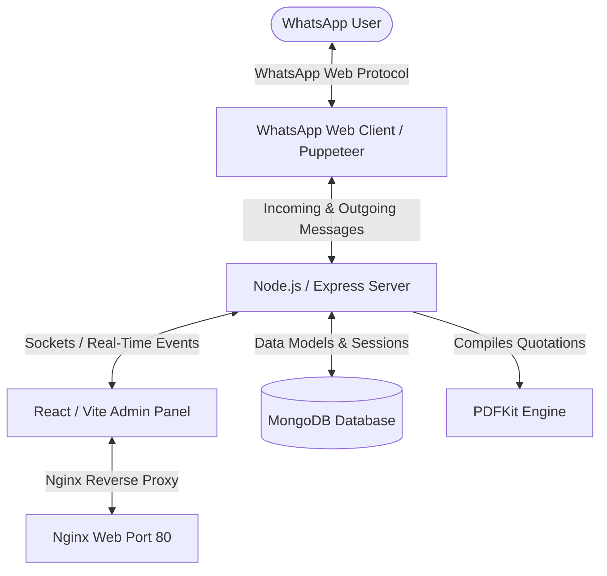

# 📱 Majisa WhatsApp CRM & AI Lead Capture System

A state-of-the-art, enterprise-grade Customer Relationship Management (CRM) platform and AI Chatbot designed specifically for **Majisa Web Solutions**. This application automates customer acquisition, pricing estimation, proposal generation, and live conversation management by integrating directly with the WhatsApp Business platform.

---

## 🏗️ System Architecture

The application is structured as a full-stack monorepo containerized with Docker.



### Technical Stack
* **Frontend**: React (JS), Vite, Vanilla CSS, Socket.io-client, Vitest.
* **Backend**: Node.js, Express, MongoDB (Mongoose), Socket.io, `whatsapp-web.js` (Puppeteer headless), PDFKit, Jest.
* **Orchestration**: Docker, Docker Compose, Nginx.

---

## 🌟 Key Features

### 1. Interactive WhatsApp Chatbot
* **Puppeteer Integration**: Leverages `whatsapp-web.js` to initialize a headless browser and authenticate using a QR code (displayed in terminal or on the admin panel in real-time).
* **State-Machine Conversational Flow**: Guides users through a questionnaire (Name, Company, Email, Phone, City, Service, Budget, Timeline, Features) to capture complete project parameters.
* **Anti-Loop Counter**: Automatically pauses the chatbot, sets the customer status to "Talk to Executive", and triggers a dashboard alert after 3 consecutive invalid options to prevent chat loops.
* **Auto-Resume & Reset**: Detects greetings (e.g. "hi", "hello", "menu", "restart") to auto-resume the bot if paused or if the customer is returning.

### 2. NLP-Based Lead Auto-Extraction
* **Zero-Form Profiling**: Parses unstructured greetings like *"I am Rahul from Apex IT, email me at rahul@apex.com. Looking for an Android application."*
* **Regex & Keyword Processing**: Instantly extracts contact details, company name, email, and maps services.
* **Auto-Qualification**: Immediately saves the customer as a "New Lead", skips the state-machine questions for already-extracted fields, and alerts the admin team.

### 3. Dynamic Pricing & Quotation Engine
* **Database-Driven Schema**: Pricing parameters (base packages, extra pages, features) are stored as dynamic database rules rather than hardcoded configuration.
* **Interactive Proposals**: Automatically calculates estimations based on client input, generates a professional PDF invoice, saves it to `./quotations/`, and sends the PDF directly to the client's WhatsApp window.
* **Admin Customization**: Admins can customize pricing packages and feature costs on-the-fly, invalidating the backend cache immediately.

### 4. Admin Management Dashboard
* **KPI Metrics**: Total Leads, Active Bot Conversations, Pending Executive chats, and Conversion Rate.
* **Live Chat Engine**: Real-time message exchange powered by Socket.io, including media uploads (images, PDFs, audios, documents).
* **Chat Control Panel**: Toggle bot state manually (`Bot Active` vs `Bot Paused`), edit lead details, assign lead owners, and record internal admin notes.
* **Reports**: Interactive charts displaying service distributions, lead sources, and conversion funnels.
* **Backup Utility**: Scheduled database backups and manual restore operations.

---

## 🗄️ Database Schemas & Data Model

The application utilizes MongoDB to store all persistent records. The primary collections are:

| Model | Schema File | Purpose |
| :--- | :--- | :--- |
| **Customer** | `server/src/models/Customer.js` | Stores customer profiles, current pipeline status, contact details, notes, and bot status. |
| **Chat** | `server/src/models/Chat.js` | Manages active chat threads, unread counts, and last message timestamps. |
| **Message** | `server/src/models/Message.js` | Logs individual chat logs (sender type `ADMIN`, `BOT`, or `CUSTOMER`), type, and read statuses. |
| **ChatState** | `server/src/models/ChatState.js` | Tracks the active position of the customer in the chatbot questionnaire state machine. |
| **PricingRule** | `server/src/models/PricingRule.js` | Dynamic service base-pricing, feature fees, page configurations, and sort orders. |
| **Quotation** | `server/src/models/Quotation.js` | Records generated quotations, cost breakdowns, and PDF reference links. |
| **Admin** | `server/src/models/Admin.js` | Stores portal credentials (bcrypt hash) and system access roles. |
| **Notification** | `server/src/models/Notification.js` | Manages real-time notifications for the admin dashboard (e.g. New Lead, Bot Paused). |

---

## 🛣️ API Endpoints Reference (v1)

### Authentication
* `POST /api/v1/auth/register` - Create new administrator.
* `POST /api/v1/auth/login` - Authenticate admin and return JWT cookie.
* `POST /api/v1/auth/logout` - Clear session token.
* `GET /api/v1/auth/me` - Retrieve current admin profile.

### Chat & Live Messages
* `GET /api/v1/chats` - List all active chat conversations.
* `GET /api/v1/chats/:customerId/messages` - Retrieve message history for a specific customer.
* `POST /api/v1/chats/send` - Send an outgoing text message.
* `POST /api/v1/chats/send-media` - Upload and send a base64 media message.
* `PUT /api/v1/chats/:chatId/read` - Mark a conversation as read (resets unread counts).
* `DELETE /api/v1/chats/:chatId` - Permanently delete a conversation thread and its messages.

### Lead & Customer Directory
* `GET /api/v1/customers` - Get all customer records (with filters and search).
* `GET /api/v1/customers/:id` - Fetch single customer details.
* `PUT /api/v1/customers/:id` - Update customer properties, notes, or bot status.
* `DELETE /api/v1/customers/:id` - Soft-delete a customer record.

### Quotations & Pricing Configuration
* `GET /api/v1/pricing` - Get all active pricing rules.
* `POST /api/v1/pricing` - Create a new pricing rule.
* `PUT /api/v1/pricing/:id` - Update a pricing rule (auto-invalidates chatbot cache).
* `POST /api/v1/quotations/calculate` - Estimate cost based on specific selection.
* `POST /api/v1/quotations` - Save a generated quotation.
* `GET /api/v1/quotations` - List compiled customer quotations.

---

## 🚀 Installation & Local Development Setup

### Prerequisites
* **Node.js** (v18 or higher)
* **MongoDB** (Running locally or hosted)
* **npm** (v9 or higher)

### Setup Steps

1. **Clone the Repository**
   ```bash
   git clone <repository-url>
   cd Majisa-Whatsapp-CRM
   ```

2. **Configure Backend Settings**
   Create a `.env` file in the `server` directory:
   ```env
   PORT=5000
   MONGO_URI=mongodb://localhost:27017/majisa_whatsapp_crm
   JWT_SECRET=your_jwt_secret_key
   JWT_EXPIRES_IN=7d
   CLIENT_URL=http://localhost:5173
   ```

3. **Install Dependencies & Start Backend**
   ```bash
   cd server
   npm install
   npm run dev
   ```
   *Upon startup, the server automatically seeds the database with default pricing configurations if it is empty.*

4. **Configure Frontend Settings**
   Install frontend dependencies:
   ```bash
   cd ../client
   npm install
   npm run dev
   ```
   *The frontend dashboard will run on `http://localhost:5173`.*

---

## 🐳 Docker Deployment (Production)

The CRM system includes pre-configured Dockerfiles and a `docker-compose.yml` for single-command production deployment.

### Start the Containers
From the root directory, run:
```bash
docker-compose up --build -d
```

This starts three services:
1. **crm-mongodb**: MongoDB database (mounted to host directory `.mongo_data`).
2. **crm-backend**: The API server with persistent volume mapping for uploads and WhatsApp sessions.
3. **crm-frontend**: A production-ready React build hosted inside Nginx on Port 80, which acts as a reverse proxy for all API, upload, and Socket connections.

---

## 🧪 Testing and QA

The project utilizes automated unit, integration, and manual checklists to guarantee stability.

* **Backend Integration Tests**: Run in Jest with:
  ```bash
  cd server && npm test
  ```
* **Frontend Component Tests**: Run in Vitest with:
  ```bash
  cd client && npm test
  ```
* **Database Resilience Checks**: Test database backup and restore operations:
  ```bash
  cd server && node src/scripts/backup_verify.js
  ```

For a comprehensive checklist of end-to-end verification steps, review the [Enterprise Testing & QA Guide](file:///d:/Projects/Majisa-Whatsapp-CRM/docs/testing_guide.md).

---

## 🧑‍💻 Project Directory Structure

```
Majisa-Whatsapp-CRM/
├── client/                      # React Frontend Application
│   ├── src/
│   │   ├── components/          # Shared components (Sidebar, Chat window, etc.)
│   │   ├── context/             # Auth and socket context management
│   │   ├── pages/               # Dashboard, Chats, Customers, Pricing views
│   │   └── main.jsx             # Entry point
│   ├── vite.config.js
│   └── nginx.conf               # Production Nginx reverse-proxy setup
├── server/                      # Node.js Express API Server
│   ├── src/
│   │   ├── chatbot/             # Bot state-machine, handlers, and NLP logic
│   │   ├── controllers/         # Express endpoint controllers
│   │   ├── models/              # Mongoose data models
│   │   ├── repositories/        # Repository pattern for database access
│   │   ├── services/            # Business services (WhatsApp, Auth, Analytics)
│   │   ├── sockets/             # Socket.io configuration and event emitters
│   │   ├── server.js            # Node startup script
│   │   └── app.js               # Express application initialization
│   └── package.json
├── docs/                        # Postman collection & testing manual guides
├── docker-compose.yml           # Production composition setup
└── README.md                    # Root project documentation (this file)
```

---

## 📧 Support and Maintainers
For modifications, upgrades, or issues, please contact the administrative support team at **info@majisaweb.com** or reference the corporate web portal at **www.majisaweb.com**.
